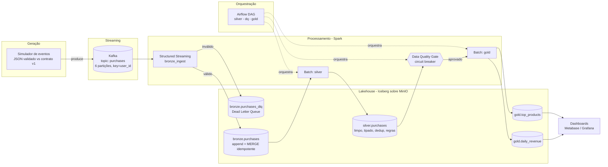

# Arquitetura

## Visão geral (vertical slice: `purchase`)

## Camadas e garantias

| Camada | Tabela Iceberg | Responsabilidade | Garantia-chave |
|--------|----------------|------------------|----------------|
| Bronze | `bronze.purchases` | Dados brutos normalizados | **Idempotência** (MERGE por `event_id` + checkpoint) |
| DLQ | `bronze.purchases_dlq` | Payloads inválidos | Stream não quebra; incidentes mensuráveis |
| Silver | `silver.purchases` | Limpeza, tipagem, dedup, regras de negócio | Determinística e reprocessável |
| Gold | `gold.daily_revenue`, `gold.top_products` | KPIs de negócio | Só publicado se passar no **DQ Gate** |

## Por que estas decisões (índice de ADRs)

- [ADR-0001](adr/0001-table-format-iceberg.md) — Iceberg como table format.
- [ADR-0002](adr/0002-streaming-engine-spark.md) — Spark Structured Streaming.
- [ADR-0003](adr/0003-data-contract-json-schema.md) — Data contract (JSON Schema → Avro).
- [ADR-0004](adr/0004-medallion-and-quality-gate.md) — Medallion + Quality Gate.

## Garantias de correção demonstráveis

1. **Exactly-once efetivo no sink** — o simulador injeta duplicatas
   (`DUPLICATE_RATE`); `show_gold.py` prova que `linhas == event_id distintos` no
   Bronze. Reprocessar offsets não infla a receita.
2. **DLQ** — o simulador injeta inválidos (`BAD_EVENT_RATE`); eles aparecem em
   `bronze.purchases_dlq`, nunca no Bronze válido.
3. **Quality gate** — `quality_gate.py` retorna != 0 e bloqueia o Gold quando uma
   regra bloqueante falha.

## Caminho para produção (sem reescrever os jobs)

| Local (slice) | Produção (cloud) |
|---------------|------------------|
| MinIO | Amazon S3 |
| Iceberg REST local | AWS Glue Catalog / Nessie |
| Spark no container | EMR / EMR Serverless / Glue |
| JSON + JSON Schema | Avro + Schema Registry (compat BACKWARD) |
| Airflow local | MWAA / Astronomer |
| Métricas locais | CloudWatch + Grafana Cloud |
